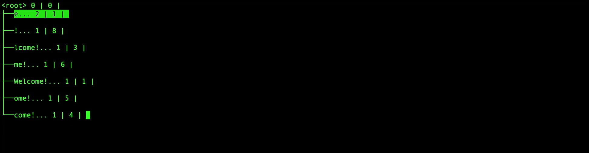
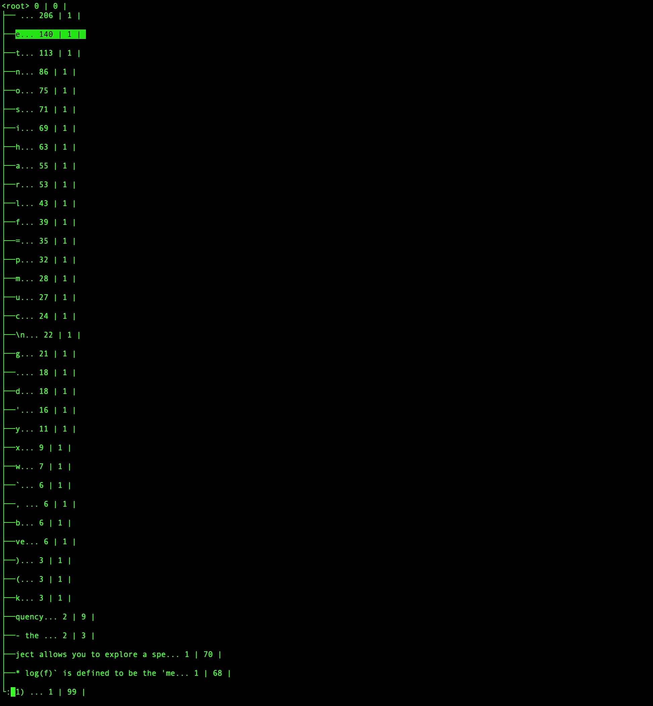
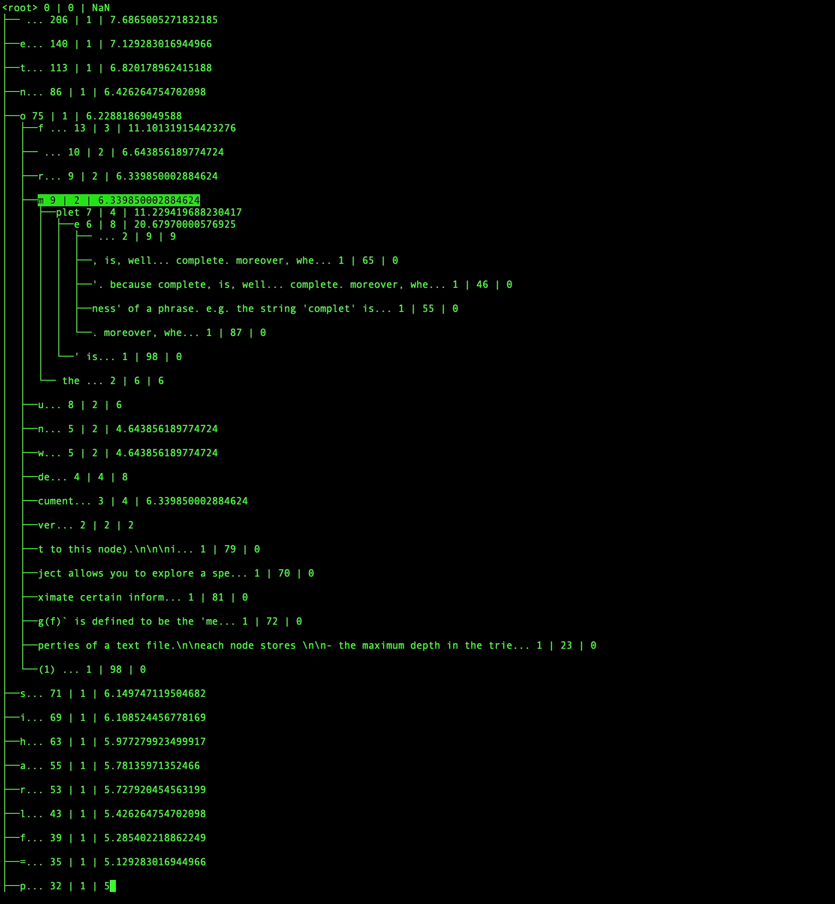

Meaningfulness Trie Explorer
===================================

This project allows you to explore a special kind of doubly linked suffix trie. 

The suffix trie allows you to approximate certain information theoretical properties of a text file.

Each node stores 

- the maximum depth in the trie that that subtrie exists in the trie. 
- the frequency that the string represented by that node has been seen (this string is the concatenation of the path from the root to this node).

Running the project
---------------------

It is a Rust cargo project. Once you have rust and cargo installed, simply clone the repository, and run 

`cargo install`

then 

`cargo run`

Navigation
--------------

- `l` to go right
- `h` to go left
- `j` to go down
- `k` to go up
- Enter to expand a node
- Tab to go to the longest meaningful string (explained in the theory section below)

Commands
------------

To type a command, type `:<command>`

- `:load` load a file from the file system
- `:meaning` display meaningfulness of all nodes

Theory
----------

If `l` is the depth of the node, and `f` is the frequency, then `l * log(f)` is defined to be the 'meaningfulness' of that string. The meaningfulness roughly tells you how 'important' the string is. 

High meaningfulness corresponds to the 'completeness' of a phrase. E.g. the string 'complet' is less meaningful than the string 'complete'. Because complete, is, well... complete. Moreover, when you go from the phrase 'complete '.

If you take the ratio  of the meaningfulness of a phrase in a specific document to the meaningfulness of that phrase over all documents, this is the 'relative meaningfulness' of that phrase. The relative meaningfulness of the phrase is how descriptive that phrase is of the document.

Storing the parents of the trie allow you to quickly travel to the 'longest meaningfulness phrase' containing that substring. This is what pressing tab does.

Images
------------

### Load command 

### Meaningfulness 

### Tab navigation 
